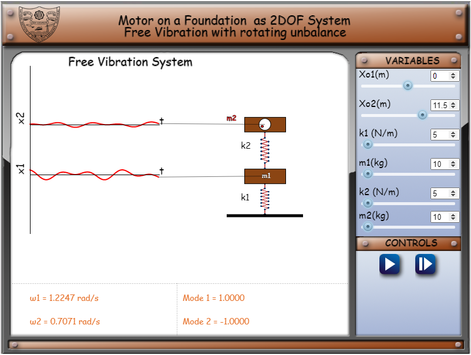
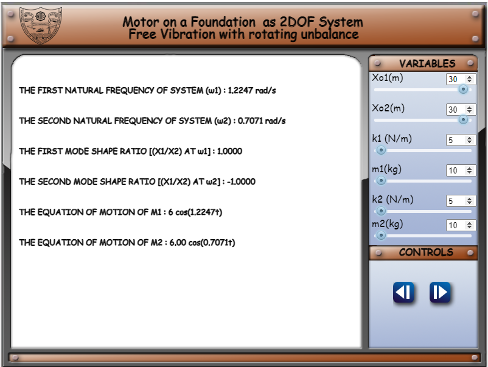
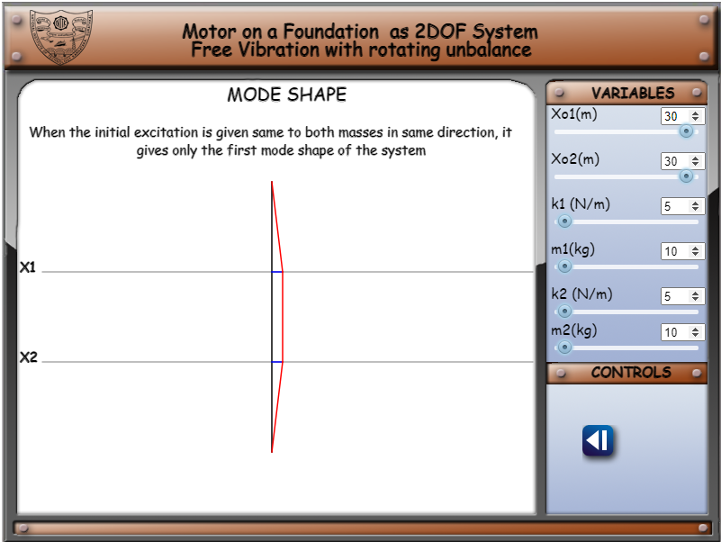

1. Clicking on the simulation tab brings the user to the first page of simulation as shown below.

Here the user can use the slider to set the values and the simulation of the spring-masss system will change accordingly.
The comments section will show the first natural frequency &omega;1 and second natural frequency &omega;2
 

2.  On clicking the next button, which will take the user to the next page where the first and second frequencies, mode shapes and finally equation of motion are displayed.

  

3. On clicking the next button which will take the user to the final page where the mode shapes are displayed.

