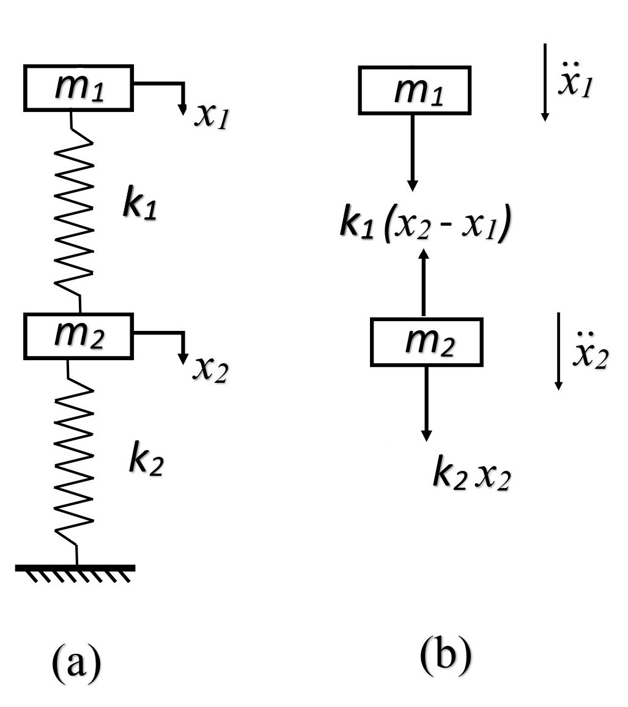

An electric motor as shown in Fig. 1, is used for power transmission. It consists of many parts such as stator and rotor, where the performance of motor depends on how precisely it's rotor is manufactured.
A simple error wile manufacturing a rotor leads to unbalanced forces acting on the entire system, that creates unwanted vibrations.

Fig. 1. Schematic of Motor

Now, to analyze the vibration of the motor with rotation of unbalance of mass is modelled as 2DOF system as shown in Fig. 2.

Fig. 2. Schematic of motor of unbalanced mass as 2DOF (a) Combined system (b) Free body diagram

A two degree of freedom system can be defined as a system, that requires two independent variables to describe its position from the equilibrium. It has two equations of motion i.e., for two masses or for each degree of freedom. It introduces the coupling phenomenon where the motion of any one of the two independent coordinates is dependent on the other, through the coupling springs or dash-pots.
Consider an ideal two degrees of freedom system as shown in Fig. 2, where the masses are constrained to move in the direction of the spring axes. Let $x_1$ and $x_2$ be the displacements of the masses at any instant measured from the equilibrium positions of these masses respectively, which are positive in the direction shown. Let’s assume $x_2$ > $x_1$

The governing differential equations are

<!--  -->

$m_1 \ddot{x}_1 + k_1 (x_1 - x_2) = 0$  
$m_1 \ddot{x}_2 + k_2 x_2 - k_1 (x_1 - x_2) = 0$

Let,

<!--  -->

$x_1 = X_1 \sin(\omega t)$   
$x_2 = X_2 \sin(\omega t)$

where,   
$X_1$ - Amplitude of mass $m_1$  
$X_2$ - Amplitude of mass $m_2$  

Substituting this in the governing equation,

<!--  -->
<!--  -->

$X_1 = \frac{(k_1 + k_2 - m_2 \omega^2)}{(m_1 m_2 \omega^4 - \{m_1(k_1 + k_2) + m_2 k_1\} \omega^2 + k_1 k_2)}$
  
$X_2 = \frac{k_1}{(m_1 m_2 \omega^4 - \{m_1(k_1 + k_2) + m_2 k_1\} \omega^2 + k_1 k_2)}
$  

Where,

<!--  -->

$\omega_1 = \sqrt{\frac{k_1}{m_1}}$ $\omega_2 = \sqrt{\frac{k_2 + 2k_1}{m_2}}$

<!--  -->

where $\omega_1$ is the first natural frequency  
$\omega_2$ is the second natural frequency

To observe resonance:
1. Set the value of $m_1$ = $m_2$
2. Set the value of $k_1$ = $k_2$
3. Pause the simulation and enter the value of either $\omega_1$ or $\omega_2$, which is shown below the animation.
4. Resume the simulation to view in-phase or out of phase animation and mode shapes.
